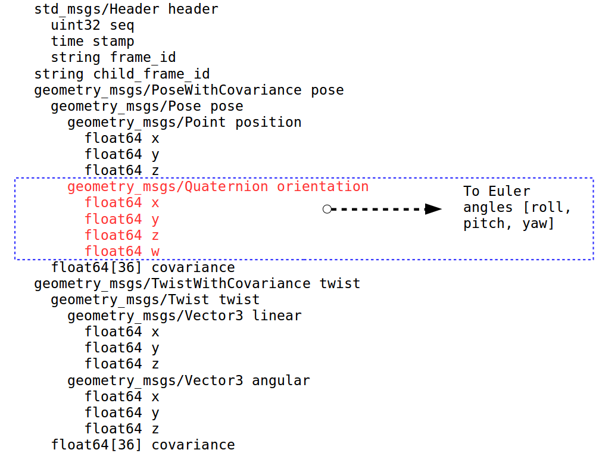

# Quaternion-to-Euler-ROS-Message
This ROS node converts angles in **quaterion**  from nav_msgs/Odometry to **Euler** angles geometry_msgs/Vector3. A test is done on uINS- a GPS integrated sensor- with an intent of solving for the heading of the base station.

